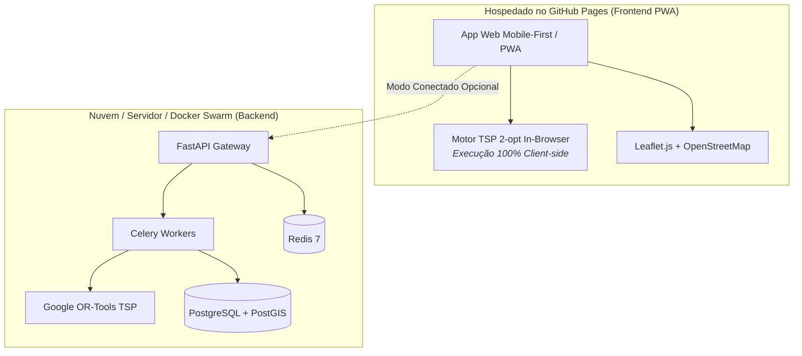

# GEOFRETE 🚀
### Otimizador Inteligente de Rotas Last-Mile para Entregadores Autônomos

O **GEOFRETE** é uma plataforma SaaS B2C (R$ 49,99/mês) projetada especificamente para entregadores autônomos (motoboys, motoristas de aplicativo e frotas de entrega rápida). Permite o escaneamento contínuo em lote de etiquetas (via câmera/OCR do app mobile), normaliza e geocodifica endereços com resiliência para o Brasil (CEP + OpenStreetMap), e calcula o itinerário ideal resolvendo o **Problema do Caixeiro Viajante (TSP)** com o **Google OR-Tools** (no backend) e heurística **2-opt** (no navegador).

---

## 🌐 Hospedagem no GitHub Pages & Arquitetura Híbrida

O GEOFRETE foi desenhado com uma **arquitetura híbrida** para permitir que o aplicativo seja hospedado gratuitamente no **GitHub Pages**:



### 1. Modo Standalone In-Browser (Padrão GitHub Pages)
- Não requer nenhum servidor ativo ou banco de dados pré-configurado.
- O entregador ou visitante acessa a URL do GitHub Pages e pode carregar lotes de etiquetas e calcular rotas instantaneamente usando o motor de **Otimização TSP 2-opt implementado em JavaScript**.
- Renderiza pinos numerados no mapa interativo com links diretos para navegação no **Waze** e **Google Maps**.

### 2. Modo Conectado (API FastAPI + Google OR-Tools)
- Conecta-se à infraestrutura de microsserviços via Docker para processamento pesado em larga escala com Celery, PostGIS e OR-Tools.
- A URL do backend pode ser configurada diretamente no painel de configurações do app web.

---

## 🚀 Como Ativar no GitHub Pages

1. Faça push do repositório para o seu GitHub.
2. No seu repositório no GitHub, acesse **Settings** > **Pages**.
3. Em **Build and deployment** > **Source**, selecione **GitHub Actions**.
4. O workflow automático [deploy-pages.yml](file:///Users/marco/code/geofrete/.github/workflows/deploy-pages.yml) irá publicar a aplicação no endereço:
   ```
   https://<seu-usuario>.github.io/<seu-repositorio>/
   ```

---

## 💻 Como Executar Localmente

### Frontend Web (PWA)
Para testar a interface do GitHub Pages localmente:
```bash
cd frontend
python3 -m http.server 3000
```
Acesse [http://localhost:3000](http://localhost:3000).

### Backend Completo com Docker Compose
Para subir todo o ecossistema (PostGIS, Redis, API e Celery Worker):
```bash
docker compose up --build
```
Acesse:
- **Documentação Swagger**: [http://localhost:8000/docs](http://localhost:8000/docs)
- **Health Check**: [http://localhost:8000/api/v1/health](http://localhost:8000/api/v1/health)

### Deploy do Backend em Produção (Docker Swarm)
O arquivo [docker-stack.yml](file:///Users/marco/code/geofrete/docker-stack.yml) unifica a stack para clusters:
```bash
docker stack deploy -c docker-stack.yml geofrete
```

---

## 📡 Endpoints da API

| Método | Rota | Descrição |
| :--- | :--- | :--- |
| `POST` | `/api/v1/batches/upload` | Envia lote de até 150 pacotes/etiquetas em formato JSON |
| `GET` | `/api/v1/batches/{batch_id}` | Consulta status do processamento e barra de progresso |
| `GET` | `/api/v1/batches/{batch_id}/detail` | Detalhes do lote com todos os pacotes e coordenadas |
| `GET` | `/api/v1/batches/{batch_id}/route` | Retorna o itinerário otimizado na sequência exata de entregas |
| `GET` | `/api/v1/health` | Diagnóstico de integridade do Banco de Dados e Redis |

---

## 🧪 Testes Automatizados

Para rodar a suíte de testes com cobertura de otimizador, geocodificação e endpoints:
```bash
docker run --rm -v $(pwd)/backend:/app geofrete-backend pytest -v
```
Todos os 13 testes cobrem algoritmos TSP, parsing de CEP, fallbacks de geocodificação e endpoints REST.
